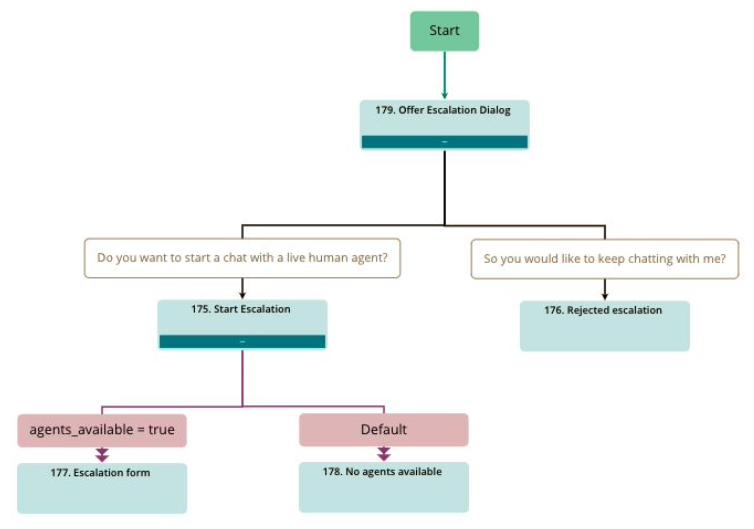
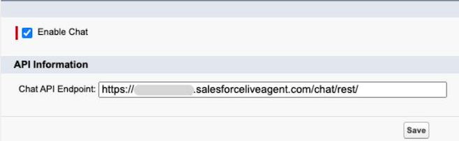
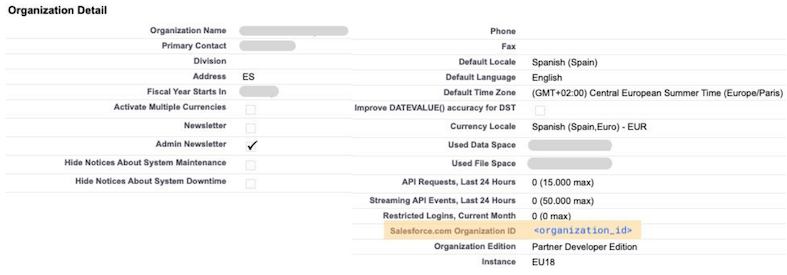

# SALES FORCE INTEGRATION

### TABLE OF CONTENTS
* [Introduction](#introduction)
* [Features](#features)
* [Preparation](#preparation)
    * [Inbenta](#inbenta)
        * [Contents](#contents)
        * [Variables](#variables)
    * [Salesforce Live Agent](#salesforce-live-agent)
        * [Environment](#environment)
        * [Configuration](#configuration)
            * [Enable chat](#enable-chat)
            * [Live Agent Users](#live-agent-users)
            * [Company organization](#company-organization)
            * [Chat Deployment](#chat-deployment)
            * [Live Agent Skills](#live-agent-skills)
            * [Chat button](#chat-button)
            * [Live Agent Application](#live-agent-application)
* [Building the connector](#building-the-connector)
    * [Middleware connector](#middleware-connector)
        * [Required configuration (middleware)](#required-configuration-middleware)
        * [Deployment](#deployment)
    * [Chatbot SDK Adapter](#chatbot-sdk-adapter)
        * [Required configuration (SDK)](#required-configuration-sdk)
        * [Optional configuration](#optional-configuration)
* [Troubleshooting](#troubleshooting)
    * [The chat invitation does not appear in Agent's console](#the-chat-invitation-does-not-appear-in-agents-console)
* [How to test and debug it?](#how-to-test-and-debug-it)
    * [Testing](#testing)
    * [Debugging](#debugging)
        * [Middleware connector debugging](#middleware-connector-debugging)
        * [Chatbot SDK adapter debugging](#chatbot-sdk-adapter-debugging)
* [More information](#more-information)
    * [Inbenta documentation](#inbenta-documentation)
    * [Salesforce Live Agent documentation](#salesforce-live-agent-documentation)


## Introduction
The purpose of this documentation is to define the integration of Inbenta's Chatbot with Salesforce Live Agent.

## Features

These are the supported features when escalation to Salesforce Live Agent
- Check agent availability
- Transfer conversation transcript
- Transfer conversation details info
- Send raw text messages from User to Agent
- Send raw text messages from Agent to User
- Send files from User to Agent
- End the chat conversation from Agent's side
- End the chat conversation from User's side

## Preparation

### Inbenta

#### **Contents**

The default contents are:
- Chat with a human
- Offer Escalation Dialog
- Start Escalation
- Rejected Escalation
- Escalation form
- No Agents Available

And the dialog will look like this:



For a detailed explanation of how to create the contents and the dialog, follow the [Chatbot - Default contents for live chat escalation](https://help.inbenta.io//en/default-contents-for-live-chat-escalation/)​


#### **Variables**

Confirm you have the default variable **​agent_available** created in your Inbenta APP going to _Knowledge > Variables_.​ In case you don't see this variable, contact with Inbenta.

### Salesforce Live Agent

#### **Environment**

Make sure you have a working setup of Live Agent within your Salesforce organization. For detailed instruction go to [​Salesforce - Chat with customers on your website](https://help.salesforce.com/s/articleView?language=en_US&id=live_agent_intro.htm)

**Required editions**
- Chat is available in: Salesforce Classic and Lighting Experience
- Chat is available in: ​Performance Editions and in ​Developer Edition orgs that were created after June, 2012
- Chat is available in: ​Unlimited​ Edition and ​Enterprise​ Edition with Service Cloud

Live Agent feature is available starting with Enterprise edition. It is also accessible for Developer user

#### **Configuration**

In order to activate the Live Agent service you will need to perform some configuration in different Salesforce sections.

Lately, you will need the following credentials in order to configure the connector:
- Chat API endpoint
- Organization ID
- Deployment ID
- Button ID

Below you will find the way to configure the Live Agent service and obtain the required information.

##### **Enable chat**

First of all, you will have to activate the Live Agent feature. To do this:
1. Navitage to Salesforce **Setup​** page.
2. In the **Quick ​Find** box, enter ​_Chat_ and then select **Chat Settings** (formerly Live Agent
Setting).
3. Select the **Enable** Chat​ checkbox.
4. In the API Information you will get the URL to **Chat API Endpoint​**:



5. Finish by clicking the ​Save​ button.

> Note: When copy the **Chatbot API Endpoint**, don't include “**/chat/rest/**”

##### **Live Agent Users**

Before your users can assist customers with chat, you need to assign the users as ​**Live Agent users**​. **​Live Agent ​users** are support agents and supervisors who have the Salesforce permissions to assist customers with chat. All ​**Live Agent ​users** need the API Enabled administrative permission enabled on their associated profile before they can use Live Agent.

In order to do so, follow the steps:
1. Navitage to Salesforce **Setup​** page.
2. In the **Quick Find​** box, enter _Users​_ and then select **Users**.​ _ADMINISTRATION => Users => Users_
3. Click the **​Edit​** button next to a user's name.
4. Select **Chat User​** (formerly Live Agent User).

> ⚠ If you don't see this checkbox verify that your support organization has purchased enough Live Agent feature licenses.

5. Finish by clicking the **​Save​** button.

After enabling Live User Agents, make sure you associate them with the appropriate skills.

##### **Company organization**

1. Navigate to Salesforce **Setup​** page.
2. In the **Quick Find​** box, enter _C​ompany_ and then select **Company Information.** _SETTINGS => Company Settings => Company information_
3. In the **​Organization Detail**,​ find the **​Organization ID​**:



##### **Chat Deployment**

1. Navigate to Salesforce **Setup​** page.
2. In the **Quick Find​** box, enter _Deployment​_ and then select **Deployments**. _PLATFORM TOOLS => Feature Settings => Service => Chat => Deployments_
3. In the ​**Deployments​** menu, click **New​** button to create a new **Chat Deployment**.
4. Fill the required fields and click **Save**.
5. Go back to the Deployments menu and locate the Deployment created and select it to go
to the details page.
6. The **​Deployment​ ID**​ can be obtained from:
    
a. The page **URL**:

```html
 https://<sub-domain>.lightning.force.com/lightning/setup/LiveChatDeploymentSettings/page?address=%2F​<deployment_id>
```

b. The **​Deployment​ ​Code​** section:

```html
<script
  type='text/javascript'
  src='https://<sub-domain>.salesforceliveagent.com/content/g/js/48.0/deployment.js'>
</script>
<script type='text/javascript'>
liveagent.init('https://<sub-domain>.salesforceliveagent.com/chat', '​<deployment_id>​', '​<organization_id>​');
</script>
```

##### **Live Agent Skills**

1. Navigate to Salesforce **Setup**​ page.
2. In the **Quick Find​** box, enter _Skill​_ and then select **Skills​**. _PLATFORM TOOLS => Feature Settings => Service => Chat => Skills_
3. In the ​Skills​ menu, click **New​** button to create a new **Live Agent Skill.**​
4. Fill the required fields.
5. Select users (and/or profiles) for which **L​ive Agent Skill​** will be available.
6. Add them into ​Selected​ **Users​** (and/or **Selected Profiles​**)
7. Finish by clicking the **​Save​** button.


##### **Chat button**

1. Navigate to Salesforce **Setup​** page.
2. In the **Quick Find​** box, enter _Chat Button​_ and then select  **Chat Buttons & Invitations​**. _PLATFORM TOOLS => Feature Settings => Service => Chat => Chat Buttons & Invitations_
3. In the **Chat Buttons & Invitations​** menu, click **New​** button to create a new **Chat Button**​.
4. Fill the required fields.
5. In the ​**Routing​ information​** section, select the **Live Agent Skill​** that you just created.
6. Finish by clicking the **Save​** button.
7. Go back to the **​Chat Buttons & Invitations** menu and click on the created button to be redirected to the **Chat Buttons & Invitations Details** ​view.
8. The **​Button ID​** can be obtained from:

a. The page **URL​**:

```html
https://<sub-domain>.lightning.force.com/lightning/setup/LiveChatButtonSettings/page?address=%2F​<button_id>
```

b. The **​Chat Button Code​** section:

```html
<a id="liveagent_button_online_<chat_button_code>" href="javascript://Chat" style="display: none;" onclick="liveagent.startChat('​<chat_button_code>​')">
    <!-- Online Chat Content -->
</a>
<div id="liveagent_button_offline_​<chat_button_code>​" style="display: none;">
    <!-- Offline Chat Content -->
</div>
<script type="text/javascript">
  if (!window._laq) { window._laq = []; }
  window._laq.push(function() {
    liveagent.showWhenOnline('​<chat_button_code>​',
    document.getElementById('liveagent_button_online_​<chat_button_code>​'));
    liveagent.showWhenOffline('​<chat_button_code>​',
    document.getElementById('liveagent_button_offline_​<chat_button_code>​'));
  });
</script>
```

##### **Live Agent Application**

Finally create the Live Agent application:

1. Navigate to Salesforce **Setup​** page.
2. In the **Quick Find​** box, enter _Apps​_ and then select **Apps**​. _PLATFORM TOOLS => Apps => App Manager_
3. In the **Apps Manager​** menu, click **New​** button to create a new ​**App**.
4. Complete the steps as it follows:
    
    a. Step 1: specify **​App ​​name** ​and **Developer ​name**.

    b. Step 2: select **Console Navigation** and leave supported factors as default.

    c. Step 3: optionally add **Utility items**.

    d. Step 4: add the following **Navigation items**:
        
        i. Chat Visitors
        ii. Chat Sessions
        iii. Chat Supervisor
        iv. Chat Transcriptions

    e. Step 5: leave **Navigation​ Rules​** as default.

    f. Step 6: select the **​User ​Profile** that will have access to the application in the Console. For example, profile of developer user - System Administrator.

    > ⚠ If you don't see a specific profile, go back to Profiles and double check the **visible​** checkbox is enabled.

    g. Finish by clicking the **​Save & Finish​** button. 

5. Finish by clicking the ​**Save & Finish​** button.

Verify that the **App** ​has been created correctly by checking that it appears in the **APP​ Launcher​**.


## Building the connector

You can find the Chabot Salesforce template on GitHub. You can download or clone the template from ​[GitHub => Inbenta Integrations => Salesforce Chatbot Template](https://github.com/inbenta-integrations/line_chatbot_template)​.

The template contains the full code including:

- Back-end middleware connector
- Front-end SDK application

### Middleware connector

The code related to the middleware connector is inside the **/connector​** folder. 

The main endpoint route should be the file located in **public/**.​

The connector has all the logic related to Salesforce Live Agent Rest API. It offers different endpoints that are used called from the JS adapter:

- **/init**​ used to initiate a chat conversation.
- **/availability** ​this will check whether there are agents available or not.
- **/message/receive** used to retrieve events from agent to user.
- **/message/send** ​used to send events from user to agent.
- **/message/file** ​used to send files from user to agent.

The **events​** that can occur during the conversation are:

- Chat established
- Agent typing
- Agent not typing
- Chat messages
- Chat request fail
- Agent disconnect
- Chat transferred
- File request

There are more events in Salesforce Live Agent that are not needed (not used). For more information about events check [​Salesforce - Live Agent REST API Messages](https://developer.salesforce.com/docs/atlas.en-us.live_agent_rest.meta/live_agent_rest/live_agent_rest_Messages_responses_overview.htmhttps://developer.salesforce.com/docs/atlas.en-us.live_agent_rest.meta/live_agent_rest/live_agent_rest_Messages_responses_overview.htm)​.

The connector uses Redis database in order to keep the conversation transcript during the session so it can be retrieved in case any of the parts need to reconnect. For example in case that the user changes or refreshes the website.

#### **Required configuration (middleware)**

The configuration involves Salesforce Live Agent tokens and also the Redis database credentials:

- Go to **​src/Configuration/redis.php​** and set your Redis configuration URL.
- Go to **​src/Configuration/sfla.php** and set your Salesforce Live Agent configuration credentials (the tokens you obtained previously).

In **sfla.php** file, additional to the Live Agent configuration credentials (_endpoint, organizationId, deploymentId, buttonId_), you can set the assignation of Backstage variables equivalence with SalesForce needed data (for the form when escalation occur). You can add more variables if you need it:

```php
return [
    'endpoint'       => '<chatbotEndpoint>', //Do not include "/chat/rest/" in the endpoint string
    'organizationId' => '<organizationId>',
    'deploymentId'   => '<deploymentId>',
    'buttonId'       => '<buttonId>',

    // Variables names from Backstage and its assignation to Salesforce
    'variablesContact' => [ //FirstName, LastName and Email are mandatory
        'FIRST_NAME' => 'FirstName',
        'LAST_NAME' => 'LastName',
        'EMAIL_ADDRESS' => 'Email'
    ],
    'variablesCase' => [ //Subject is mandatory
        'INQUIRY' => 'Subject'
    ],
    'variablesAccount' => [ //Non mandatory, empty array if not used ([])
        'ACCOUNT_NAME' => 'Name'
    ],
    'nameToShow' => 'FIRST_NAME' // Name to show in Chat
];
```

#### **Deployment**

Host all files inside the **/connector** folders in a server and prepare the endpoint to be set later in the adapter configuration.

You must use a public webserver to serve the Salesforce Live Agent connector. This makes it possible for Salesforce to send events to it. The environment where the connector was developed and tested has the following specifications
- Apache 2.4
- PHP 7.3
- PHP Curl extension
- Predis
- Non-CPU-bound
- The latest version of ​Composer​ (Dependency Manager for PHP), to install all dependencies that Inbenta requires for the integration.
- If the client has a ​distributed infrastructure​, this means that multiple servers can manage the user session. They must adapt their SessionHandler so that the entire session is shared among all its servers.

### Chatbot SDK adapter

The code related to the Chatbot SDK adapter is inside the **​/sdk**​ folder.

The following is provided:
- The JS adapter **adapter​** to be used within the Chatbot SDK.
- An example in the demo that shows how to use the adapter.

Please read the ​[Chatbot SDK - Adapters if you need help to understand how Chatbot SDK adapters work](https://developers.inbenta.io/chatbot/chatbot-js-sdk/sdk-adapters).

#### **Required configuration (SDK)**

The adapter JS requires a configuration that will be passed as an object when the adapter is added to the chatbot adapters list.

The configuration object must contain the following parameters:

- **Endpoint​** (String): the endpoint where the connector is located.
- **Default ​agent ​name** (String): the default name that will be displayed in case that Salesforce agent name does not exist.
- **Agent waiting timeout** (Number): the timeout for the chat invitation to expire. If the invitation is not accepted within the defined time then it will proceed like if there were no agents available.

Example of the configuration:

```javascript
let​ salesforce_configuration = {
    endpoint: ​"<endpoint/path_to_connector>"​, ​// String
    agentName: ​"Agent"​, ​// String
    agentWaitTimeout: ​60 ​// Number
}
```

#### **Optional configuration**

Inside the JS code you will find the object **defaultSalesforceConf** with the default configuration. The configuration mentioned before will replace the default one. However, you will notice that this new object has more fields that can be also configured:

- **Send ​messages ​timeout​**: this is the time that will last every request from the Chatbot to the Salesforce agent meant to wait for events from the agent side. This request will be reseted every time a new event arrives or when the timeout is triggered. Default time is 30 seconds which is the recommended time.
- **Send ​messages ​delay**:​ this is the time the Chatbot will wait to send messages to the agent. The recommended time is 2 seconds.
- **Input ​identifier​**: identifier of the Chatbot window input. This should not change so leave it as default.

## Troubleshooting

### The chat invitation does not appear in Agent's console

If the chat escalation works correctly with no error messages but the invitation does not appear in the agent's console. Check the Salesforce credentials configuration, especially the **​button Id​**.

Also, confirm that the agent has rights to accept invitations from the specified queue.

## How to test and debug it?

### Testing

Simply use the chatbot and escalate to the agent.

It is recommended to use the chatbot in the **​development** environment and also to use a testing queue from Salesforce Live Agent.

### Debugging

#### **Middleware connector debugging**

The connector already has a **Logger​** feature that you can use to start tracking data. Simply add the logger namespace to the file you want to work and start using it as a static function.

Find the configuration in ​**src/Configuration/logs.php​**.

```php
use​ ​Utils​\​Logger​;

Logger​::​logText​('​Initialize​');
```

See it is initialized and used in **​public/index.php**. ​When initiated, it will set an identification this way you can easily isolate the trackings that come from the same request.

#### **Chatbot SDK adapter debugging**

The JS adapter has already prepared a debugging feature that can be activated through the configuration. Inside the adapter JS you will be a default configuration that contains a parameter named ​**debug** that accepts **​boolean** values. When set to **​true** it will log to the console a predefined useful log. You can add more logs by using the function named **dd** ​like this:

```javascript
d​(<COMMENT>, <VARIABLE_1>, <VARIABLE_2>, ... , <VARIABLE_N>);
```

There are some examples inside the JS adapter code **adapter/salesforce-connector-adapter.js​**.

## More information

### Inbenta documentation

Inbenta Chatbot SDK - Adapters
<https://developers.inbenta.io/chatbot/javascript-sdk/sdk-adapters​>

Inbenta Chatbot SDK - Escalation adapter V2
<https://developers.inbenta.io/chatbot/javascript-sdk/sdk-adapters/nl-escalation-adapter-2>​

Inbenta Chatbot - Contents for chat escalation
<https://help.inbenta.io//en/default-contents-for-live-chat-escalation/​>


### Salesforce Live Agent documentation

Salesforce - Chat REST API Developer Guide
<https://developer.salesforce.com/docs/atlas.en-us.live_agent_rest.meta/live_agent_rest/live_agent_rest_understanding_resources.htm>​